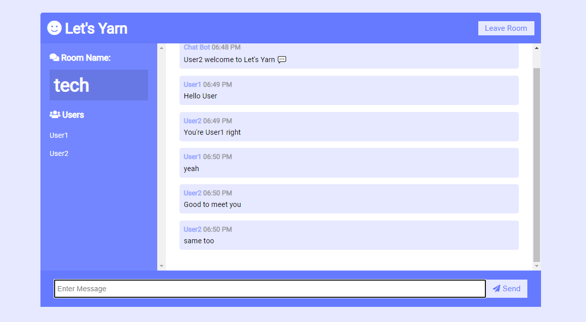
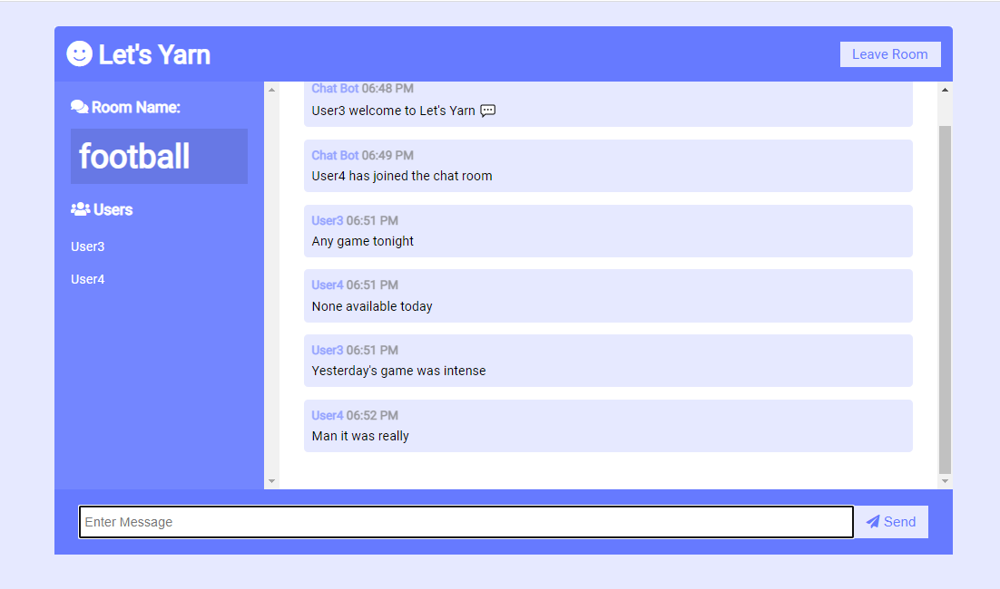

# LET'S YARN APP
This app shows how real-time chats can be made possible through the use of sockets. A socket is one endpoint of a two-way communication link between two programs running on the network. Socket enables bi-directional communcation between a server and a client without the need of a http requests. The concept of socket is that the server catches an emitted event from a socket and broadcasts the response to all sockets connected to the server.

[See documentation here](https://socket.io/docs/v4/).

# INSTALLING THE PROJECT
1. Clone the repository to your local machine by running the command, `git clone https://github.com/malachi43/Real-time-chat-app.git` in your CLI (terminal). For this command to work you must have git installed. To download click [here](https://git-scm.com/downloads).

2. cd ( change directory ) into chatUp directory.

3. run `npm install` in your terminal( command line ) to install the required dependencies.

4. run `node server.js` to start the server on port 3000.

# USING THE LET'S YARN CHAT APP
1. Open your browser and enter the url *http://localhost:3000*

2. Open this url ( *http://localhost:3000* ) on at least two tabs to serve up the Let's Yarn App.

3. The Let's Yarn App has two fields for **Username** and **Room**. This fields are compulsory, as the *Username* field helps to distinguish one user from another and the *Room* field makes it possible for users belonging to a common room to see their chats.

4. You can only see chats specific to the room you joined.

# See illustrations below

If you look closely at the four images you would notice that User1 and User2 belong to the **tech** room and User3 and User4 belong to the **football** room.

**User1** and **User2** can't see the chats between **User3** and **User4** likewise **User3** and **User4** can't see the chats of **User1** and **User2** because they all belong to different *rooms*.

let's yarn 💬

[Live Demo Here](https://real-time-chat-app-m2us.onrender.com).